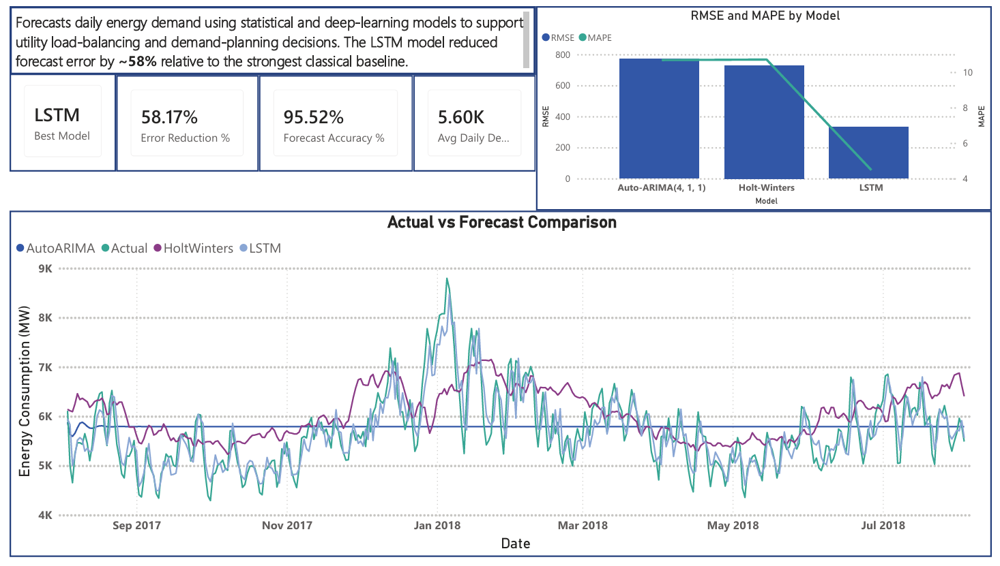

# Energy Demand Forecasting

Forecasts daily energy demand using statistical and deep-learning models to
support utility load-balancing and demand-planning decisions.

## Result
LSTM reduced forecast error by 58% (MAPE: 10.7% → 4.48%) versus the
strongest classical baseline (Auto-ARIMA / Holt-Winters), using a 60-day
sliding-window sequence model.

## Dashboard

Open `dashboard/dashboard.pbix` in Power BI Desktop to interact.

## Approach
1. Cleaned and explored ~143K hourly energy-demand records (PJM Interconnection)
2. Compared ARIMA, Holt-Winters Exponential Smoothing, and LSTM
3. Built a Power BI dashboard to surface model performance and forecasts

## Tech Stack
Python, pandas, statsmodels, pmdarima, TensorFlow/Keras, Power BI
